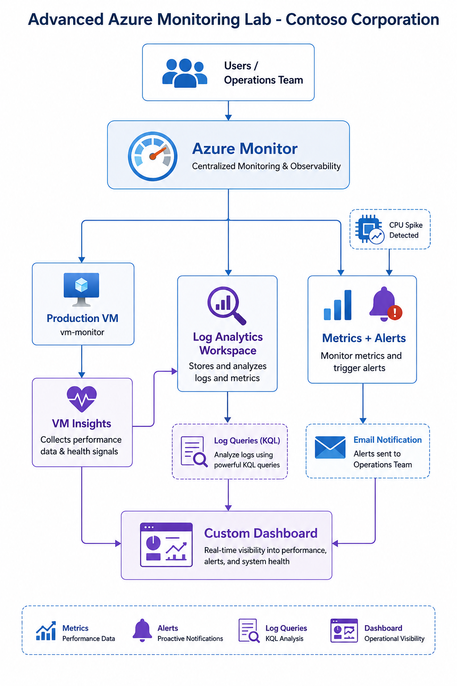

# Advanced Azure Monitoring & Alerting Lab

**Azure Monitor + Log Analytics + VM Insights + Alerts + Dashboards**

## 🎯 Scenario
**Contoso Corporation** needs a centralized monitoring solution to:
- Monitor VM performance and health
- Detect high CPU, memory, and availability issues
- Generate automatic alerts
- Collect and analyze logs for troubleshooting
- Improve operational visibility with custom dashboards

## 🏗️ Architecture

## 🛠️ Services Used
- Azure Monitor
- Log Analytics Workspace
- VM Insights
- Metrics & Alerts
- Dashboards

## 📋 Lab Content
- [Step-by-Step Guide](./Step-by-Step-Guide.md)
- [Verification & Testing](./Verification.md)

**Lab Completed Successfully!** 🎉

---

⭐ Star this repo if it helped you with AZ-104!
